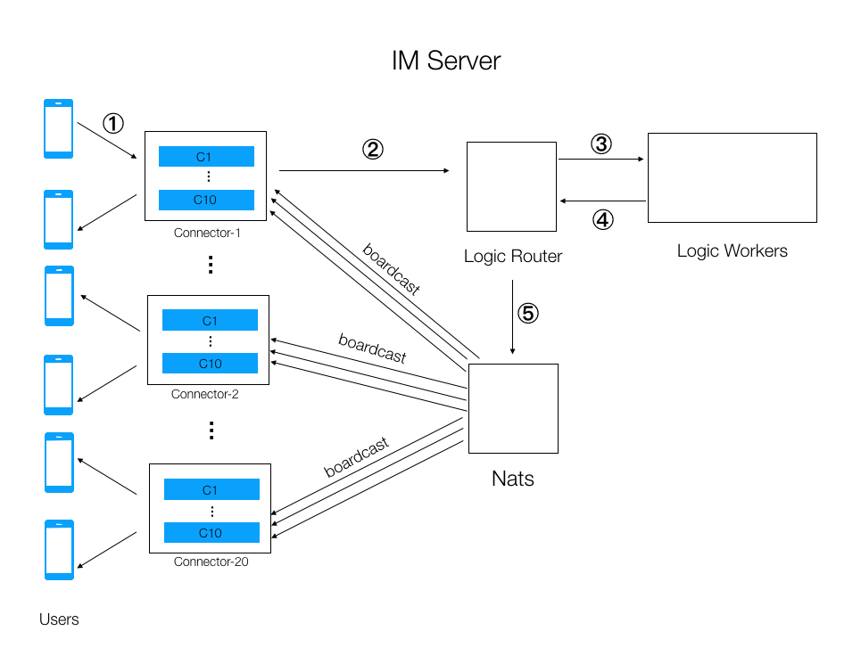

# Telegraph

Telegraph is a web-communicator for sending and receiving messages via **nats** server.

## Nats server


NATS is a connective technology built for the ever increasingly hyper-connected
world. It is a single technology that enables applications to securely communicate
across any combination of cloud vendors, 
on-premise, edge, web and mobile, and devices. 

NATS consists of a family of open source products that are tightly integrated but 
can be deployed easily and independently. 

NATS is being used globally by thousands of companies, spanning use-cases including microservices, edge computing, 
mobile, IoT and can be used to augment or replace traditional messaging.

The NATS Server acts as a central nervous system for building distributed applications. 
Client APIs are provided in over 40 languages and frameworks including Go, Java, 
JavaScript/TypeScript, Python, Ruby, Rust, C#, C, and NGINX. 

Real time data streaming, highly resilient data storage and flexible data retrieval are supported through 
JetStream , the next generation streaming platform built into the NATS server.



## How to use ?
#### Join/Register to a room to begin the communications
url:
```shell
/api/join
```

method:
```shell
POST
```

request:
```json
{
  "username": "[your name]",
  "password": "[your password]"
}
```

response:
```json
{
  "token": "[JWT token]"
}
```

#### Send a message 
url:
```shell
/api/publish
```

method:
```shell
POST
```

header:
```json
{
  "jwt-token": "[the jwt token you got from join]"
}
```

request:
```json
{
  "sender": "[your application name]",
  "message": "[message you want to send]"
}
```

response:
```json
{
  "id": "[message id]",
  "sender": "[your name]",
  "message": "[message you send]",
  "time": "[local time of message sending]"
}
```

#### Get previous messages of a person
url:
```shell
/api/suppress
```

method:
```shell
GET
```

header:
```json
{
  "jwt-token": "[the jwt token you got from join]"
}
```

request (form value):
```json
{
  "sender": "[sender name of messages]"
}
```

response:
```json
{
  "data": [
    {
      "id": "[message id]",
      "sender": "[your name]",
      "message": "[message you send]",
      "time": "[local time of message sending]"
    }, ...
  ]
}
```

## Docker
Use the following command to run the project on docker:
```shell
docker compose up -d
```

## Deploy
To deploy the project on a kubernetes cluster, use the following helm commands:<br />
First install all dependencies charts:
```shell
helm dep up ./deploy/telegraph
```

Then launch the project by the following command:
```shell
helm install ./deploy/telegraph
```

It also provides the _application.yaml_, so you can set for
cluster **ArgoCD**.